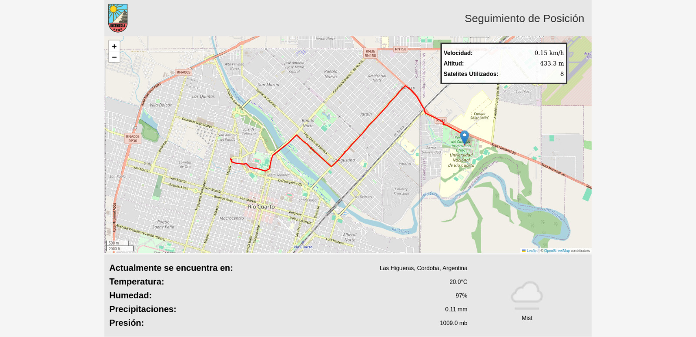

# Seguimiento y visualización de Trayectoria con GPS

Este proyecto consiste en el desarrollo e implementación de un laboratorio práctico centrado en el seguimiento y visualización en tiempo real de la trayectoria de un dispositivo GPS. Se integran tecnologías de adquisición de datos, procesamiento de señales NMEA y representación geográfica mediante herramientas modernas como Flask para la creación de interfaces web dinámicas y Folium para la generación de mapas interactivos.

El sistema fue programado en Python y permite capturar datos provenientes de un receptor GPS conectado a un puerto serial. Los datos obtenidos incluyen información clave como latitud, longitud, velocidad, altitud y número de satélites en uso. Estos datos son extraídos de tramas NMEA del tipo $GPRMC y $GPGGA y se validan utilizando cálculos de checksum para garantizar su integridad.

La funcionalidad principal del proyecto es la capacidad de operar en tiempo real, mostrando la posición actual del dispositivo en un mapa interactivo accesible desde cualquier navegador web. Además, se integró una API que complementa la experiencia al proporcionar información climática basada en la ubicación actual del dispositivo GPS.

Este proyecto combina conocimientos de comunicaciones seriales, programación multihilos, análisis de tramas NMEA y desarrollo web, destacando el potencial de la tecnología GPS en aplicaciones modernas y brindando una visión práctica de su implementación.

## Instalación

### Python

Es necesario instalar las bibliotecas requeridas, incluyendo Flask y otras utilizadas para la comunicacion con APIs o interaccion con mapas. Para hacerlo, ejecuta el siguiente comando:

```bash
pip install -r requirements.txt
```

## Uso

Para inicializar el servidor web, ejecuta el script main.py con el siguiente comando:

```bash
python3 main.py <key de WeatherAPI>
```

Accede a la interfaz principal en http://127.0.0.1:5000. La interfaz incluye varias datos y estadisticas que se pueden observar en base a la localizacion actual.



## Referencias

https://flask.palletsprojects.com

https://www.python.org/

https://python-visualization.github.io/folium/latest/
